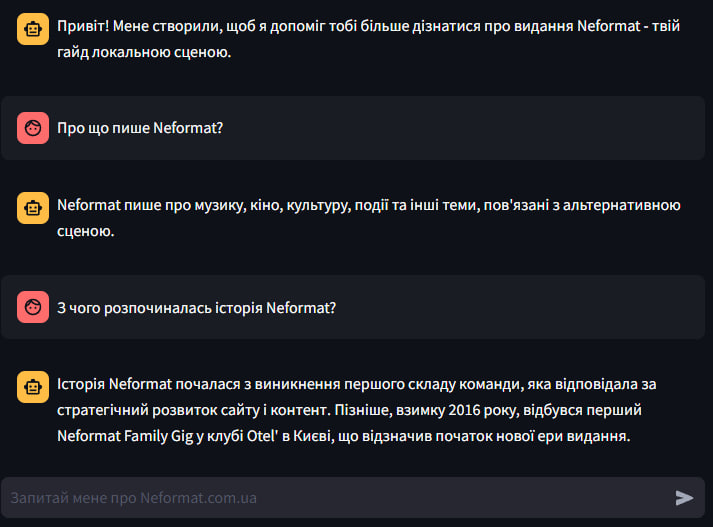

# A conversational assistant powered by LangChain, OpenAI, and Streamlit.

## Overview

This project aims to assist users in obtaining information about Neformat Media in a conversational manner. 

## Needed improvements:

* [ ] experiment with different splitting methods, chunk sizes and overlaps;
* [ ] try other embeddings and similarity search methods;
* [ ] experiment with memory.

## Acknowledgments

Thanks to [this author](https://github.com/lvendrix/notion-chatbot-public?source=post_page-----fcb385f432a2--------------------------------) for inspiration and ideas.
